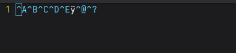
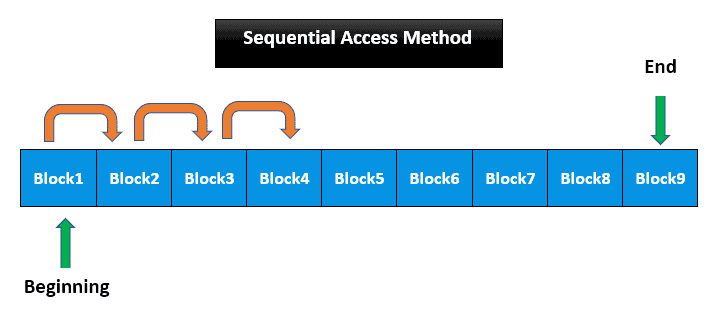
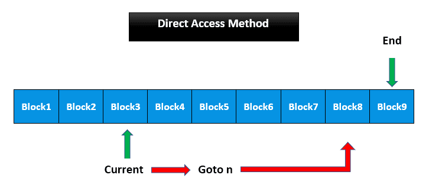
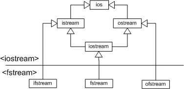

## Какво е файл?

Един файл на компютър или някакво дигитално устройство представлява проста линейна последователност от байтове, чрез която се закодират данни. В пределите на нашия курс ще работим с два типа файлове - двоични (binary) и текстови. За компютър тези два вида са едно и също нещо на ниско ниво, защото в крайна сметка са само байтове, обаче има съществени разлики за нас като програмисти.  

  - **Двоичните файлове** са висчки файлове на нашата система, при тях данните се записват бит по бит и нямаме разграничение един байт да е някакъв символ, без значение дали заема цялото пространство в този байт. Когато отворите двоичен файл, често ще видите текст без смисъл, произволни символи навсякъде. Това се случва, защото текстовия редактор, който използвате се опитват да съпостави на закодираните данни някакъв символ от ASCII.
    
  - **Текстовите файлове**' са двоични файлове, които се енкодирани според ASCII таблицата или UTF. Всеки 8 бита (1 byte) се асоциара (map-ва) към съответен символ от ASCII таблицата (или UTF репрезентация) и така се създава илюзията за текст. Друго съществено разграничение е, че самите текстови файлове не създържат терминиращия символ `'\0'` по конвенция, тъй като така се индикира, както вече знаем краят на низ в **C**, а нашият файл не може да има такъв. Освен това текстовите файлове съдържат символи за край на реда като `'\n'` (POSIX style) и `'\r\n'` (Windows style), съществува и само `'\r'` на старите MAC OS системи, но вече се използва POSIX стила.

  

  <em>Репрезентацията на двоичния файл във VS Code: 1 2 3 4 5 255 0 127</em>

## Класификация на файловете

### Според операциите, които извършваме върху тях
---

| Тип       | Своиство |
|------------|------|
| **Read Only**      | имаме достъп само за четене.  |
| **Write Only**     | имаме достъп само за писане.|
| **Read and Write** | имаме достъп както за четене така и за писане.|

### Според достъпването на данните
---

#### Последователно (Sequential)

Описание - При този метод на достъпване на данните, ние се ограничаваме да четем и пишем **изцяло последователно**.   
  
Как пишем - ако искаме да запишем нещо във файла започваме от индекс 0 и пишем до края без да пропускаме, при желание за промяна на конкретен индекс трябва да напишем файла наново да променим данните на индекса, който искаме и да препишм файал до край. Това както се досещате вече е бавна и особено неефективна операция, затова когато пишем последователно, не се очаква да правим промени по самията файл.   
  
Как четем - Четенето е на абсолютно същия принцип, ако искаме да прочетем данните на индекс n, трябва да изчетем вискчко преди n. Като винаги започваме да четем от индекс 0.  
  
Извод - последователен достъп до файлове ще използваме, когато искаме да запишем голям обем от данни, като предварително знам, че промяна няма да има или ще е на много редки интервали, тъй като промяната е много бавна операция

  

  <em>Примерна диаграма на файл с последователен достъп</em>

#### Директно (Direct)

Описание - това е подход, където ще записваме/четем данни във файл, на база тяхната физическа позиция. Можем да пишем и четем на произволни места във файла без нуждата от допълнителна памет за индексация, тъй като зависим само от самите данни

Четене/Писане - можем да достъпим данни на произволно място във файл, само да знаем позицията на която искаме да записваме и размера на данните, които ще записваме. Това може да стане като записваме предварително преди всеки запис размера му или ако всички записи са с еднакъв размер да използваме аритметика за достъп до желан адрес.

Извод - имаме много бърз и ефективен достъп за четене/писане във файл, но обаче трябва да разполагаме с предварителни знания за структурата/характера на данните, които ще записваме. 

  

  <em>Примерна диаграма на файл с директен достъп</em>

#### Други (не са обект на курса)
  
**Random** - този подход почти изцяло припокрива директния такъв, но със съществената разлика, че не е нужно да знаем информация за самата структура на данните, които ще четем. Тук се използва индексация на записаните данни, можем да имаме нещо подобно на **header** където да индексираме всеки един запис във файла, получавайки бърз и директен достъп, но на цената на повече памет, която трябва да използваме за индексация.   
  
**Indexed** - това е специален подход, който се използва за достъп до файлове по техните имена. Отново имаме индексираща таблица (често в различен файл), където съпоставяме на имена някакъв физически адрес в паметта. Този подход е често срещан при файловите системи.  

## Потоци

В C++ като език съществува понятието поток, това е една абстракция, която ни позволява да направим връзката между нашите прорами и файлове/устройства. Тези потоци ще бъдат обект на нашият предмет и ще се научим как да ги използваме и съответно да работим с тях.

Като за начало C++ ни предоставя следната йерархия от потоци:

  

  <em>Йерархия на потоците в C++</em>

**Какво има в iostream?**
  - ios - това е базовият клас за потоците в C++, той държи информация за състоянието на самия поток.   
  - istream - базовият клас за входни потоци в езика. Тук се дефинира операторa за четене >> и фунцкии за четене.
  - ostream - базовият клас за изходни потоци в езика. Тук се дефинира оператоа за извеждане << и функции за изход.
  - iostream - наследява функционалността на istream и ostream. Това е клас за потоци, които поддържат както вход, така и изход.

**Какво има в fstream?**
  - ifstream - това е поток за четене, предназначен за работа с файлове.
  - ofstream - това е поток за изход, предназначен за работа с файлове.
  - fstream  - това е поток за вход/изход, предназначен за работа с файлове.
  
Обект на нашия интерес ще бъде съдържанието на header-a fstream.

## Работа с Файлови потоци

### Отваряне на текстови файл

Първото нещо, което трябва да направим с един файлов поток е да го асоциираме към даден файл. В момента, който отворим файла всяка входно/изходна операция ще се обръща към физическия файл на устройството ви. При отвраяне на файл ще следва три прости стъпки, които трябва да са ви познати от използването на динамична памет.

1) Оваряме файла.
2) Проверяваме дали файлът е отворен успешно.
3) Затваряме файла.

~~~.cpp
#include <ifstream>

int main(void){
    // Отваряне на файл

    // Вариант 1
    std::ifstream is;
    is.open("My_Cool_File.txt");

    // Вариант 2
    std::ifstream is("My_Cool_File.txt");

    // Проверка
    if(is.is_open() ==  false) return 0;
    
    // Затваряне
    is.close();
}  
~~~

### Режими за достъп до файл 

Когато отваряме файл имаме възможността да посочим режимът, в който да се отваря даденият файл. Допустими са следните режими за достъп до файл:

| Режим      | Обяснение |
|------------|------|
| **ios::in**      | отваря файла за четене. Подразбира се за ifstream |
| **ios::out**     | За писане на произволни места във файла. Ако файлът съществува, съдържанието му се изтрива. Подразбира се за ofstream|
| **ios::binary**  | Отваря файла в двоичен режим, ако не е оказан, режимът е текстов по подразбиране |
| **ios::app**     | За писане. Можем да пишем само в края на файла|
| **ios::ate**     | За писане. Запазва режимите, в които е отворен файла, като допълнително ни позиционира в края му, но можем да се местим.|
| **ios::trunc**   | Ако съществува файл с това име, съдържанието му се изтрива. По подразбиране за ofstream|  
  
Допълнение:
  
  - Ако отворите файл в режим ios::out, ако файл с такова име съществува, съдържанието му се изтрива. За да се предотврати това, се добавя и режимът std::in, дори и не използвате потока за вход!!
  - По подразбиране fstream има режимите "in | out", но ако вие наложите ражими, тези по подразбиране не се пазят, за разлика от ofstream и ifstream, където режимите по подразбиране се пазят, дори да добавяте нови.

~~~.cpp
#include <fstream>

int main(void){

    // Комбинираме няколко режима с побитово или "|".
    // Това отваря файл за четене и писане в двоичен режим
    std::fstream is1("My_Cool_File.txt", std::ios::in | std::ios::out | std::ios::binary);
    if(!is1.is_open()) return -1;

    std::fstream is2("My_Cool_File.txt", std::ios::ate);
    if(!is2.is_open()){
        is1.close();
        return -1;
    }

    is1.close();
    is2.close();
}
~~~

Както виждате в примера, аз отварям два различни потока към един и същи файл. Това не е препоръчително, като даже самата ОС може да убие повикването. Проблемът е в това, че ще се заделят два отделни буфера за потоците, които няма да са синхронизирани и при близки промени на данните, това може да доведе да инвалидация на файла (corruption).

### Операции за извличане и запис

Разполагаме със следните входно/изходни операции за работа с текстови потоци:

| std::ifstream     | Обяснение                                         | std::ofstream | Обяснение                     |
|-------------------|---------------------------------------------------|---------------|-------------------------------|
| **get**           | прочита един символ от потока                     | **put**       | записва един символ в потока  |
| **getline**       | прочита n на брой символи от потока в даден буфер | **<<**        | форматиран изход              |
| **>>**            | чете форматирано от потока                        |

~~~.cpp
#include <fstream>

int main(void){
    std::ifstream is("My_Cool_File.txt");
    std::ofstream os("My_Cool_File2.txt");

    // Четене
    char c;
    char buffer[10];

    c = (char)is.get();
    is.getline(buffer, 10);
    is >> buffer; // не се препоръчва. Може да надхвърли буфера

    // Писане
    os << c;
    os.put(c);
}
~~~

## Състояние на поток 

При работа с потоци трябва да имаме начин да разберем дали операциите ни са били успешни, затова след изпълнението на операция нашият поток може да бъде в едно от следните 4 състояния:

| Режим       | Обяснение |
|-------------|-----------|
| **good**    | потокът е наред. |
| **bad**     | При последната операция е възникнала грешка, от която потокът не може да се възстанови. |
| **fail**    | При последната операция е възникнала грешка, но с подходящи мерки работата на потока може да се възобнови. |
| **eof**     | Опитали сме да извлечем елемент след края на потока. |
  
Как възстановяваме състоянието на потока?  
  
Това става с функцията **clear()**, тя сваля всички флагове от потока. Погрижете се преди да извикате clear(), да сте отстранили проблемът с потока!

~~~.cpp
#include <fstream>

int main(void){
    std::ifstream("My_Cool_File.txt");

    char c;
    is >> c;
    if(is.fail()) { // еквивалентно на !is
        // fix..
        is.clear();
    }

    // чете до края на потока
    while(is) {
        c = is.get();
    }

    is.close();
    return 0;
}
~~~

