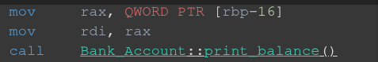

## Изложение на проблема 

В това упражнение ще си говорим за виртуални функции в C++, които могат да имплементираме различна логика спрямо това, кой ги извиква. Но преди да стигнем до тях, нека се запознаем с проблема, който те решават.

Ето един пример за това как можем да имаме няколко абсолютно еднакви по прототип член функции в различни разширения на даден клас, обаче те да не са виртуални. В този случай, имаме различна логика за всеки тип, но не можем да се възползваме от това по никакъв начин?

~~~.cpp
#include <iostream>
using namespace std;

class Bank_Account {
public:
    Bank_Account(float balance) : balance(balance){}; 
    void print_balance() { cout << "Cannot access balance in a non user profile!\n"; }
protected:
    float balance;
};

class Checking_Account : public Bank_Account {
public:
    Checking_Account(float balance) : Bank_Account(balance){};
    void print_balance() { cout << "Checking_Account balance is " << balance << '\n'; }
};

class Savings_Account : public Bank_Account {
public:
    Savings_Account(float balance) : Bank_Account(balance){};
    void print_balance() { cout << "Savings_Account balance is " << balance << '\n'; }
};

int main(){
    Bank_Account        b_a(0);
    Checking_Account    checking(100);
    Savings_Account     savings(1000);

    // Когато ги използваме асоцирани към своят си тип всичко е както очаквано?
    b_a.print_balance();            // --> Cannot access balance in a non user profile!
    checking.print_balance();       // --> Checking_Account balance is 100 
    savings.print_balance();        // --> Savings_Account balance is 1000

    // Нека се опитаме да ги унифицираме към базовият им клас
    Bank_Account* base_ptr1 = &checking;
    Bank_Account* base_ptr2 = &savings;

    // Тук очакваме отново да изпише същото, както горе, но това ли ще стане?
    base_ptr1->print_balance();     // --> Cannot access balance in a non user profile!
    base_ptr2->print_balance();     // --> Cannot access balance in a non user profile!
    
    return 0;
}
~~~

**Това е типичен пример за статично свързване на функции в C++**

Нарича се статично, тъй като адресът на функцията е ясен на нашия компилатор по време на работата му. Той вижда, че **base_ptr1** е от тип **Bank_Accout**, затова директно при извикването на ``base_ptr1->print_balance();``, в генерираните **assembly** команди има поставен адрес на дефиницията на функцията в класа Bank_Account и нищо повече.
  

  
    
(другите две инструкции са за подаване на this аргумента)

  
Преди да продължим напред, важен момент ще бъде да си припомним на какви сегменти се разделяше нашата програма. Тъй като това ще ни помогне да разберем как функционира полиморфизма в **C++**

| Сегмент | Съдържание | Кога се генерира | Права за достъп |
| :--- | :--- | :--- | :--- |
| **Code (Text)** | Машинните инструкции на функциите. | Compile-time | Read-Only / Execute |
| **Data (ROData)** | vtable, typeinfo, низови литерали, const променливи. | Compile-time | Read-Only |
| **Data (G/S)** | Глобални и статични променливи. | Compile-time | Read/Write |
| **Heap (Купчина)** | Динамична памет (new, malloc). | Runtime (в движение) | Read/Write |
| **Stack (Стек)** | Локални променливи, параметри на функции, адреси за връщане. | Runtime (в движение) | Read/Write |

Сега с помоща на тази табличка можете да се ориентирата и да видите как се построяват и как изглеждат нашите класове за компилатора. Тази диаграма представя **много симплифицирано** в кой клас кои функции са дефинирани и съответно до какви данни имаме достъп:

~~~.cpp
                                              |                      |          
                                              |----------------------|                                      
                                              |   float B_A::balance  |                                                    
                                              |----------------------|     (Stack)                                       
                                              |                      |                                                                                         
                                        ------|----------------------|-------                                   
                                              | B_A::print_balance() |     (Code Segment)
                                              |----------------------|          
                
                      |                        |                    |                        |
                      |------------------------|                    |------------------------|
                      |    float B_A::balance   |                    |    float B_A::balance   |
                      |------------------------|                    |------------------------|
                      |                        |                    |                        |
                ------|------------------------|--------------------|------------------------|------
                      |   B_A::print_balance() |                    |   B_A::print_balance() |
                      |------------------------|                    |------------------------|
                      |   C_A::print_balance() |                    |   S_A::print_balance() |
                      |------------------------|                    |------------------------|
                          (Code Segment)                                  (Code Segment)
~~~
  
  
Проблемът или по-скоро лимитацията на сегашните ни опити надяваме се вече стана ясен. Искаме инструмент с помощта на който да имплементираме различна логика между класовете без да ни интересува в действителност с кой от тях наистина работим, искаме **полиморфизъм**.

## Виртуални функции

Това са специални функции в езика, които могат да бъдат единствено и само дефинирани като член функции, асоцирани към даден тип (клас). Като думичката **virtual** пишем пред декларацията на функцията в класа, който я декларира (дефинира) за първи път.

``virtual void print_balance();``

Ако искаме да предефинираме логиката в някой клас наследник, трябва да напишем отново декларация и дефиниция на функцията с желаната от нас логика, като този път думичката **virtual** не е задължителна, тъй като функцията вече е декларирана като виртуална в базовия клас.   

При предефиниране можете да използвате и думата **override**, която се появява в C++ 11 и ориентира компилатора, че функцията върху която е поставена, предефинира виртуална такава и ако не се намери функция със същия прототип в някой базов клас се показва компилационна грешка. Ключовата дума главно ни защитава от синтактични грешки...

Ето как можем да разпишем примера ни наново:

~~~.cpp
#include <iostream>
using namespace std;

class Bank_Account {
public:
    Bank_Account(float balance) : balance(balance){}; 
    virtual void print_balance() { cout << "Cannot access balance in a non user profile!\n"; }
protected:
    float balance;
};

class Checking_Account : public Bank_Account {
public:
    Checking_Account(float balance) : Bank_Account(balance){};
    virtual void print_balance() override { cout << "Checking_Account balance is " << balance << '\n'; }
};

class Savings_Account : public Bank_Account {
public:
    Savings_Account(float balance) : Bank_Account(balance){};
    virtual void print_balance() override { cout << "Savings_Account balance is " << balance << '\n'; }
};

int main(){
    Bank_Account        b_a(0);
    Checking_Account    checking(100);
    Savings_Account     savings(1000);

    // Това ще е абсолютно същото
    b_a.print_balance();            // --> Cannot access balance in a non user profile!
    checking.print_balance();       // --> Checking_Account balance is 100 
    savings.print_balance();        // --> Savings_Account balance is 1000

    // Но тук ще видим същинска промяна!
    Bank_Account* base_ptr1 = &checking;
    Bank_Account* base_ptr2 = &savings;

    // Като с някаква магия, функциите ни работят както сме ги дефинирали?
    base_ptr1->print_balance();     // --> Checking_Account balance is 100 
    base_ptr2->print_balance();     // --> Savings_Account balance is 1000

    // Същото важи и за референции
    Bank_Account& base_ref1 = checking;
    Bank_Account& base_ref2 = savings;

    base_ptr1->print_balance();     // --> Checking_Account balance is 100 
    base_ptr2->print_balance();     // --> Savings_Account balance is 1000
    
    return 0;
}
~~~

Това на първи поглед изглежда или ужасно тривиално или като черна магия, но истината е, че си има стриктно инжинерно обяснение...

Идеята е, че в момента, в който напишете ключовата дума **virtual** в някой клас, той както и всеки негов наследник ще получат по един скрит указател към така нареченета **виртуална таблица**

**Виртуалната таблица**

Това е специален имплицитно скрит указател, който се намира първа позиция в паметта на нашия обект. Той ще ни заведе към блок от паметта на програмата ни, скрит в **Read Only Data** сегмента.

Ето така изглежда виртуалната таблица за нашия клас **Checking_Account**

~~~.cpp
[ Vtable за Checking_Account ]         [ Typeinfo за Checking_Account ]
+----------------------------+         +-------------------------------+
| Offset to top (0)          |          | vtable for typeinfo_class     |
+----------------------------+         +-------------------------------+
| Pointer to Typeinfo  ----->|-------->| Name: "16Checking_Account"    |
+----------------------------+         +-------------------------------+
| Address of print_info()    |         | Pointer to Base Typeinfo      |
+----------------------------+         +-------------------------------+
| други виртуални функции    |
+----------------------------+
~~~

Какво представлява всеки параметър:

**Offset** - това е отстъп, който се използва при множествено наследяване за да се гарантира, че функциите в таблицата винаги ще са подредени и индексирани по еднакъв начин. За сега не е наш интерес.

**Typeinfo** - това е указател към друг блок от памет, където се намира информация за типа на нашия клас. Това е много полезно, тъй като благодарение на него можем да използваме **dynamic_cast**, който ни позволява да преобразува безопасно от базовия клас до клас наследник.

**Адреси към функции** - това е сърцето на таблицата. Тук ще се намират предефинираните версии на нашите функции или базовите такива, ако една фунцкия не е била предефинирана в някой наследник. Тези адреси се създават като дупки от компилатора и по-късно биват попълнени с адрси към техните дефиниции от линкера, като всяка една друга функция в езика.

След това обяснение се надявам, че вече виртуалните функции не изглеждат толкова като черна магия, а като интересно инжинерно постижение. Инжинерно постижение, което не е безплатно уви, добавянето на виртуални таблици забавя забележително много бързината на нашата програма, тъй като вече при извикване на функция не става директно, а се минава през посредник, до когото стигаме чрез дълъг скок в нашата памет...

**Once virtual, always virtual...**

Когато добавяме виртуални функции към нашите класове го правим **от горе на долу**, което означава от базовите класове надолу към наследниците. Идеята на това правило ще илюстрирам с пример:

~~~.cpp
class Base {
public:
    Base();
    ~Base() = default;
};

class Der : public Der {
public:
    Der(const char* mem) : ...allocate {};
    ~Der() { delete[] str; }
private:
    char* str;
};

int main(void){
    // позволена операция, всеки наследник може да се асоциира с базовия си клас...
    Base* b = new Der("word");
    delete b; // --> паметта на Der изтече, защото се извиква деструктора на Base със статично свързване!!!
}
~~~

Много е важно да осъзнавата както плюсовете така и минусите на виртуалните функции. Тъй като **Base** не имплементира нищо виртуално, за него компилатора не генерира виртуална таблица, така че при извикване на **delete**, ще се извика деструктора на **Der**, което води до загуба на памет...

Използвате ли виртуални методи си плащате за тях от до, затова C++ ни е предоставило възможността да направим деструктора на един клас виртуален, с цел всеки клас да има виртуална таблица и да е независим в зачистването на ресурсите си!

Ето примера отново, но написан коректно:

~~~.cpp
#include <string.h>

class Base {
public:
    Base();
    virtual ~Base() = default; // Base има виртуална таблица 
};

class Der : public Base {
public:
    Der(const char* mem) : str(strcpy(new char[strlen(mem) + 1], mem )) {}
    virtual ~Der() override { delete[] str; }
private:
    char* str;
};

int main(void){
    Base* b = new Der("word");

    /* 
    * Kомпилаторът вижда, че деструктора е виртуален, прочитат се първите 
    * 8 байта, които са адрса на таблицата и се извиква правилния деструктор 
    */

    delete b; 
}
~~~

## Абстрактни класове

Абстрактният клас, е точно това което името подсказва, чрез него определяме поведение, което неговите наследници **задължително** трябва да имплементират. Идеята за абстракетен клас наподобява така наречените **Интерфейси** в другите езици за програмиране като **C#**. 

В C++ интерфейсно поведение постигаме чрез задаване на някоя функция като виртуална, чрез добавяне на ``= 0`` след декларацията. Това генерира виртуална таблица и оказва, че адрес на дефиницията на функцията за този клас не съществува, все едно се задава nullptr във виртуалната таблица. Но въпреки това C++ ни позволява да дефинираме функцията, тя може да има имплеметация, но коренната идеят, че класа не може да бъде инстанциран остава.

Ето пример:

~~~.cpp
#include <iostream>
#include <string.h>
using namespace std;

class Animal {
public:
    virtual ~Animal() = default;
    virtual void Talk() const = 0;
};

class Dog : public Animal {
public:
    virtual ~Dog() = default;
    virtual void Talk() const override { cout << "Love the world (;"; }
};

class Cat : public Animal {
public:
    Cat(const char* name, int age) : age(age), name(strcpy(new char[strlen(name) + 1], name)) {};
    // copy logic...
    virtual ~Cat() override { delete name; }

    virtual void Talk() const override { cout << "Gonna destroy the world!"; }
private:
    int age;
    char* name;
};

// Можете да напишете дефиниция единствено извън класа
void Animal::Talk() const
{
    std::cout << "Brrrrr...";
}
~~~

## Виртуален конструктор

Тъй като конструкторът на един обект не може да бъда дефиниран като виртуален настъпва въпросът, как мога да направя копие на обект ако имам само и единствено указател към неговият базов клас. Това ще е чества ситуацият, в която ще се намирате докато решавате задачи и е много лесна за решаване, тъй като не можем да използваме конструктора по подразбиране, ще си създадем нов конструктор под формата на виртуална абстрактна функция, чрез която ще създаме обекти.

Ето как можете да го направите:

~~~.cpp
#include <iostream>
#include <string.h>
using namespace std;

class Animal {
public:
    virtual ~Animal() = default;
    virtual void Talk() const = 0;

    // Това ние ще наричаме виртуален конструктор
    virtual Animal* clone() const = 0;
};

class Dog : public Animal {
public:
    virtual ~Dog() = default;
    virtual void Talk() const override { cout << "Love the world (;"; }

    virtual Dog* clone() const override { return new Dog(*this); }
};

class Cat : public Animal {
public:
    Cat(const char* name, int age) : age(age), name(strcpy(new char[strlen(name) + 1], name)) {};
    // copy logic...
    virtual ~Cat() override { delete name; }

    virtual void Talk() const override { cout << "Gonna destroy the world!"; }

    virtual Cat* clone() const override { return new Cat(*this); }
private:
    int age;
    char* name;
};

int main(){
    Animal* animal[3]{};

    Cat* joe = new Cat("Joe", 10);
    animal[0] = joe;
    animal[1] = joe->clone();
    animal[2] = new Dog();

    for(int i = 0; i < 3; ++i) delete animal[i];
    return 0;
}
~~~

